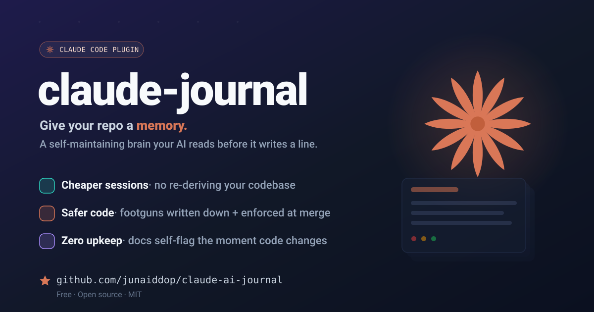
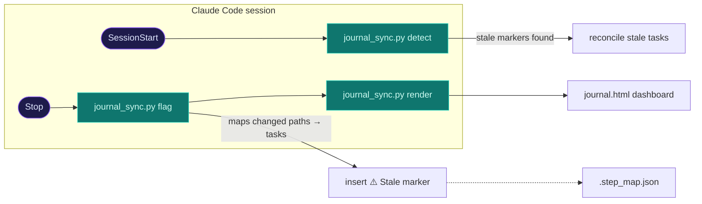

<p align="center">
  
</p>

<p align="center">
  <a href="./LICENSE"></a>
  
  
  
  
</p>

# claude-journal

**claude-journal** sets up and maintains a repo's *AI operating system*: a layered
`{project}_journal/` of docs + automation that makes every future Claude Code session
cheaper (less context re-derivation) and safer (design/security rules written down and
enforced). It ships as an installable Claude Code plugin — five factorized subagents plus
four slash commands.

## Install

Two equivalent paths — pick one.

**(a) Natural language (easiest).** Just tell Claude Code:

> add agent https://github.com/junaiddop/claude-ai-journal

Claude runs the marketplace-add and the install for you.

**(b) Explicit commands.** Run, inside Claude Code:

```
/plugin marketplace add junaiddop/claude-ai-journal
/plugin install claude-ai-journal@claude-ai-journal
```

## Usage

Once installed, in any repo:

- **`/journal-init`** — one-time setup. It first establishes your **TARGET** (the milestone
  you're driving toward — go-live, MVP, a release — asking you to confirm), then runs the
  five phases to build the journal.
- **`/journal-ship`** — day-to-day pre-merge gate: reviews the working diff against
  `dev.md`'s checklist, runs the project's checks, reconciles the journal, reports pass/fail
  with evidence. Never auto-commits.
- **`/journal-audit`** — day-to-day footgun sweep: scans the codebase for the project's top
  footgun(s), reports ranked findings with `file:line`, and proposes (not applies) fixes.
- **`/journal-gitignore`** — optional: toggle the journal between **shared** (tracked in git)
  and **private** (the whole `{project}_journal/` gitignored, local to your clone). Edits
  `.gitignore` only, never commits.

Between commands, the **SessionStart** and **Stop** hooks keep everything synced and
regenerate `journal.html` automatically (see *How sync works* below). In non-journal repos
the hooks no-op silently, so they're harmless everywhere.

## What it creates

A `{project}_journal/` at the target repo root (`{project}` = the repo name), containing
15 files:

| # | File | What it is |
|---|------|-----------|
| 1 | `README.md` | Index/map of the journal + topology diagram + maintenance rules |
| 2 | `{project}_architecture.md` | How the system is wired: boundaries, enforcement points, async flows, key-paths |
| 3 | `{project}_services.md` | Service map: count, ownership, sync/async wiring, trust boundaries + topology diagram |
| 4 | `design.md` | *(UI only)* real design tokens, reuse rules, states checklist, a11y baseline |
| 5 | `dev.md` | Security + DevOps playbook as a review gate; opens with the §0 footguns, ends with a pre-merge checklist |
| 6 | `setup.md` | First-time dev setup: prereqs, one-command run, services/ports |
| 7 | `runbook.md` | Day-to-day ops commands + recurring gotchas + the journal auto-sync section |
| 8 | `steps_pending_to_target.md` | The target tracker: numbered `#/Step/Status` table (🔴🟡🟢), each step linking to its task file |
| 9 | `pending_task/` | One file per step (goal, code paths, checklist, verification) + `.step_map.json` (path → task map) |
| 10 | `pending_task/.step_map.json` | Maps code-path prefixes → task file(s), for the sync tool |
| 11 | `issues/` | One file per bug (symptom/repro, root cause, affected paths, fix checklist) |
| 12 | `suggestions/` | One file per AI-proposed improvement — proposals for you to review, never acted on without approval |
| 13 | `journal.html` | **Generated review dashboard** — one self-contained page, four status-colored boards. *Gitignored, not committed.* |
| 14 | `claude_info.md` | Plain-language "why all these files exist" for humans opening the repo cold |
| 15 | `scripts/journal_sync.py` | The deterministic sync tool (`flag`/`detect`/`clear`/`render`) |

The `pending_task/`, `issues/`, and `suggestions/` directories are each created with a
`.gitkeep` so they persist in git while empty. `/journal-init` also appends
`{project}_journal/journal.html`, `{project}_journal/.investigation.md`, and `__pycache__/`
to the target repo's `.gitignore`.

## The subagents

| Subagent | Role |
|----------|------|
| **journal-investigator** | Phase 0 read-only recon of the stack (languages, run/test/CI, auth + data model, design tokens); pins down the 2–4 footguns everything else is grounded in |
| **journal-scribe** | Phase 1: writes the journal docs (architecture, service map, dev playbook, target tracker, tasks, `issues/`+`suggestions/` scaffolding, `claude_info`), grounded in the brief |
| **journal-automator** | Phases 2–4: the lean `CLAUDE.md` router, `.claude/` permissions + hooks, git hooks, PR template, CI gates, and git hygiene — never duplicating what the plugin provides |
| **journal-verifier** | Phase 5: link-checks the journal, pipe-tests the hooks, probe-tests the flag→detect→clear loop, renders `journal.html`, reports honestly |
| **journal-reviewer** | Ongoing maintenance: audits pending tasks against real code (evidence, `file:line`, skeptic), reconcile mode for hook-triggered scoped updates, logs bugs to `issues/` and ideas to `suggestions/` — proposals only, never creates/deletes steps without your approval |

## How sync works



Two hooks call one deterministic tool, `journal_sync.py`, which has four modes:

- **`flag`** — git-diffs the working tree, ignores journal-only changes (loop guard), maps
  changed code paths to tasks via `.step_map.json`, and inserts a `**Stale:** ⚠️` marker on
  each affected task. Idempotent.
- **`detect`** — scans tasks for stale markers and, if any, emits a `SessionStart` context
  envelope telling Claude to reconcile them. Prints nothing when clean.
- **`clear <file>`** — removes a task's stale marker after reconcile.
- **`render`** — regenerates `journal.html` from the current docs. Self-contained, no
  external requests. Idempotent.

The **Stop** hook runs `flag` then `render`; the **SessionStart** hook runs `detect`. The
script auto-detects the journal by globbing for a single `*_journal/` dir and exits `0`
silently when there is none.

## Repo structure

```
claude-journal/
├── .claude-plugin/
│   └── marketplace.json          # marketplace entry (/plugin marketplace add)
├── assets/
│   └── banner.svg                # README hero banner (self-contained SVG)
├── LICENSE
├── .gitignore
├── README.md                     # this file
└── plugins/
    └── claude-journal/
        ├── .claude-plugin/
        │   └── plugin.json       # plugin manifest
        ├── agents/               # the 5 subagents (journal-investigator/scribe/automator/verifier/reviewer)
        ├── commands/             # the 4 commands (journal-init / journal-ship / journal-audit / journal-gitignore)
        ├── hooks/
        │   └── hooks.json        # Stop → flag + render, SessionStart → detect
        ├── scripts/
        │   └── journal_sync.py   # deterministic sync tool (flag/detect/clear/render)
        └── README.md             # plugin readme
```

## License

See [`LICENSE`](./LICENSE).
