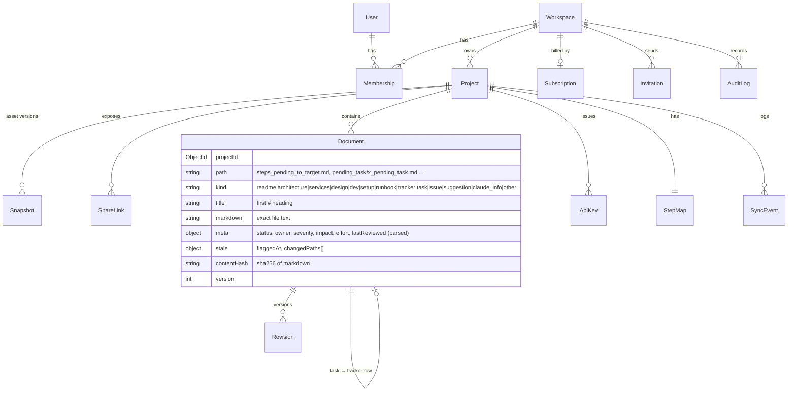
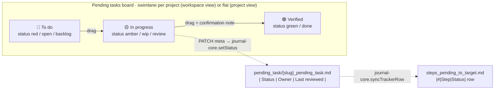
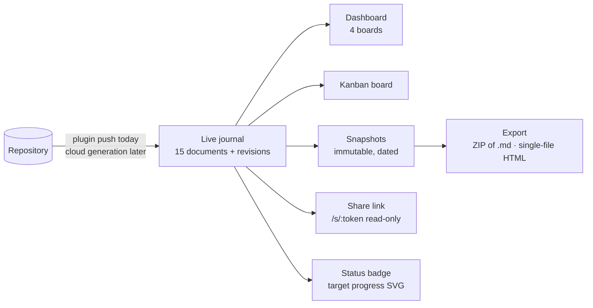
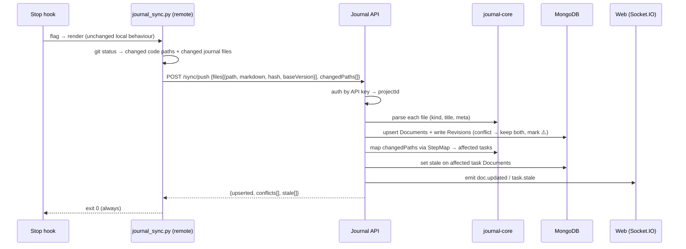
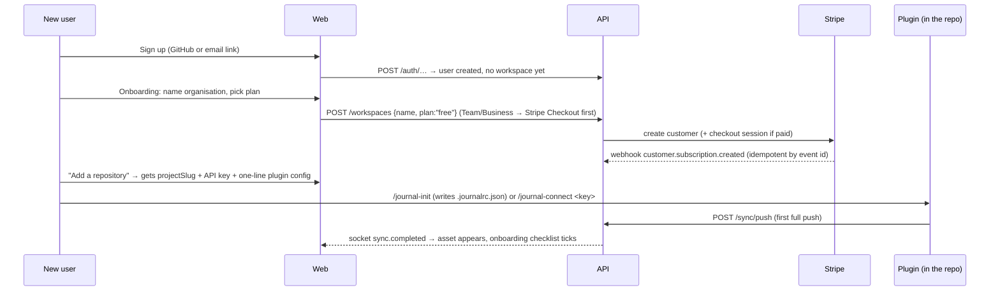

# Journal Service — Software Architecture

Last reviewed: 2026-09-08 · Status: proposal (v0.1) · Companion: [TECH_SPEC.md](./TECH_SPEC.md)

## 1. What we are building

Today **claude-journal** is a Claude Code plugin. It writes a `{project}_journal/` folder of
Markdown into each repo, and a Python script (`journal_sync.py`) plus two hooks keep that
folder in sync and render a local `journal.html` dashboard.

**Journal Service** turns that into a **multi-tenant SaaS application** on the MERN stack
(MongoDB · Express · React · Node). Teams sign up, connect repositories, and each repository's
journal becomes a **generated asset** of that repo: versioned, browsable, shareable, exportable,
and kept in sync by the plugin. The same image can also be self-hosted from the plugin's Docker
setup. The journal stops being "a folder only Claude reads" and becomes a service that:

| # | Requirement | Today | Service |
|---|-------------|-------|---------|
| R1 | Every journal file is viewable as rendered Markdown | Raw `.md` in the editor | Web viewer for all 15 file kinds, with links, tables, mermaid, status chips |
| R2 | All pending tasks are visible in one place, across repos | `journal.html` per repo, local only, gitignored | Hosted dashboard: target tracker · pending tasks · issues · suggestions, per project and across a workspace |
| R2a | Pending tasks work like a Jira board | Static list of cards | **Kanban board**: columns by status (🔴 To do · 🟡 In progress · 🟢 Verified), drag-and-drop moves that rewrite the task's status in Markdown, swimlanes per project, filters, stale badges |
| R3 | The journal stays in sync with the code | Stop/SessionStart hooks → Python script edits local files | Same hooks push to the API; stale detection runs server-side; the local files stay as the working copy |
| R4 | Nothing is lost, nothing is clobbered | Git history | Every change is a revision; conflicting edits are flagged, never overwritten |
| R5 | Works for a team, not one laptop | Journal is either committed or private per clone | Workspaces, projects, members, roles, per-project API keys |
| R6 | Hooks never break a session | Script exits 0 silently on any error | Sync client keeps the same contract: offline or server-down = silent no-op |
| R7 | Installing the plugin gives you the whole service | Plugin = agents + commands + script | Plugin also ships a Docker Compose stack; `/journal-serve up` starts the API + MongoDB in containers, and every repo on the machine syncs to that one instance |
| R8 | Works like a SaaS application | One person, one laptop | Sign-up, organisations as tenants, invitations and roles, plans with quotas, Stripe billing, onboarding wizard, audit log, data export and account deletion |
| R9 | Each repository's journal is a generated asset | A folder in the repo | A **Repository Asset**: the live journal plus immutable snapshots, a read-only share link, a status badge, ZIP/HTML export, and (later) cloud generation of the journal from the repo itself |

### Non-goals (v1)
- In v1 the service does **not** run the AI agents (investigator, scribe, reviewer, …). Those stay
  inside Claude Code where they have the repo; the plugin pushes the generated asset. Cloud
  generation (the SaaS generating the journal from a connected GitHub repo) is designed in §5.2
  and scheduled as a later phase.
- The service never edits product code. It only stores and serves journal content.
- No replacement of git. The repo's `{project}_journal/` remains valid and complete on its own.

## 2. Guiding principles

1. **Markdown is the source of truth.** The service stores the exact Markdown text of every file.
   All structured views (boards, status chips, step numbers) are *derived* by a deterministic
   parser, ported 1:1 from `journal_sync.py`. If the parser cannot read something, the raw
   Markdown still renders.
2. **Files-first, server-mirrored.** The repo folder is the working copy Claude edits. The
   service mirrors it, adds history, a UI, and cross-repo views. Either side can go away without
   corrupting the other.
3. **Proposals, not actions.** As with the plugin, the service surfaces stale tasks, conflicts,
   and issues. Humans (or Claude in the repo) act.
4. **Tenant isolation is the §0 footgun of this codebase.** Every read and write is scoped by
   `projectId` (and the caller's workspace membership). This is enforced in one place, not per
   handler.
5. **Fail silent at the hook edge, fail loud everywhere else.** The sync client never crashes a
   Claude Code session. The API and web app report real errors.
6. **One build, three ways to run it.** Multi-tenant SaaS is the primary deployment. The identical
   image self-hosts from the plugin's Compose file. Feature flags come from the plan, not from
   forks of the code.
7. **Quota and billing gates are the second §0 footgun.** Every path that creates a project,
   member, snapshot, or share link goes through one `enforceQuota()` call; every Stripe webhook is
   idempotent by event id.

## 3. System context

```mermaid
flowchart LR
    dev([Developer])
    cc[Claude Code<br/>+ claude-journal plugin]
    repo[(Repo<br/>{project}_journal/*.md)]
    web[Journal Web<br/>React SPA]
    api[Journal API<br/>Express + Socket.IO]
    db[(MongoDB)]
    gh[GitHub<br/>OAuth login · App for pull sync]
    stripe[Stripe<br/>plans, invoices]
    mail[Email provider<br/>invites, receipts]
    viewer([Stakeholder<br/>read-only share link])

    dev -->|edits code, runs /journal-*| cc
    cc -->|reads/writes| repo
    cc -->|Stop: push + flag<br/>SessionStart: detect + pull| api
    dev -->|signs up, browses, moves cards| web
    viewer -->|/s/:token| web
    web <-->|REST + WebSocket| api
    api --> db
    gh -.->|webhook on push| api
    api <-->|checkout, portal, webhooks| stripe
    api -->|transactional mail| mail
```

The service is a **hosted multi-tenant SaaS** first: one deployment, many organisations
(tenants), each with its own projects, members, plan, and billing. The same image also runs as
**containers on a developer's machine**, started by the plugin (`/journal-serve up`), for people
who want the product without an account. Nothing in the design depends on which one it is; the
plan/quota layer is simply "unlimited" in self-host mode.

**Actors**
- **Developer / team member** — signs up, creates or joins an organisation, connects repos,
  browses the dashboard and board, edits tasks, manages API keys.
- **Organisation owner** — picks a plan, pays via Stripe, invites members, exports or deletes the
  tenant's data.
- **Stakeholder** — opens a read-only share link to a repository asset; no account needed.
- **Claude Code + plugin** — unchanged commands and agents, plus one new command
  (`/journal-serve`) that manages the containers. The sync script gains a *remote mode* that
  talks to the API instead of only editing local files, and auto-detects the local instance.
- **GitHub** (Phase 3, optional) — for repos where the journal is committed, a GitHub App can pull
  the journal on push so the service stays current without the Claude Code hooks.

## 4. Container view

```mermaid
flowchart TB
    subgraph client["Developer machine"]
        plugin["claude-journal plugin<br/>hooks.json → journal_sync.py (remote mode)"]
        browser["Browser"]
    end

    subgraph compose["docker compose stack (shipped in the plugin: plugins/claude-journal/docker/)"]
        subgraph apic["container: journal-api  (image ghcr.io/junaiddop/journal-service:<plugin version>)"]
            web["apps/web (static bundle)<br/>React 19 + Vite + React Router + TanStack Query<br/>react-markdown, mermaid, Tailwind"]
            api["apps/api<br/>Express 5 + Mongoose + Socket.IO + zod<br/>auth · projects · documents · sync · dashboard"]
            worker["Agenda worker (same process)<br/>re-parse, link-check, GitHub pull"]
            core["packages/journal-core<br/>deterministic parser + step-map + stale logic<br/>(port of journal_sync.py, golden-tested)"]
        end
        mongo[(container: journal-mongo<br/>mongo:7, named volume journal_data)]
    end

    plugin -->|http://localhost:4000, X-Api-Key| api
    browser -->|http://localhost:4000| web
    web -->|/api/v1, ws| api
    api --> core
    worker --> core
    api --> mongo
    worker --> mongo
```



| Container | Responsibility | Talks to | Datastore |
|-----------|---------------|----------|-----------|
| `apps/web` | Markdown viewer, four-board dashboard, task/issue/suggestion editing, project settings | API (REST + Socket.IO) | none (browser cache only) |
| `apps/api` | Auth, tenancy, document store, sync endpoints, dashboard queries, real-time events | MongoDB, GitHub API (optional) | MongoDB |
| `apps/api` worker role | Background jobs: full re-parse after a bulk push, link check, GitHub pull | MongoDB | MongoDB (Agenda collection) |
| `packages/journal-core` | Pure functions: parse status tables, tracker rows, step map, stale markers; render nothing | — | — |
| plugin sync client | Push/pull/flag/detect against the API; falls back to local-only mode | API | local files |

Deploy unit count: **two containers**. `journal-api` is one Node process serving the API, the
WebSocket, the Agenda worker, and the built web bundle as static files. `journal-mongo` is a stock
MongoDB image with a named volume. No Redis, no message broker, no reverse proxy in v1. Agenda uses
a MongoDB collection for its queue, which keeps the stack pure MERN. Split the worker or the web
bundle out only when load justifies it; the code layout already allows it.

### 4.1 Deployment topologies

| Topology | Who runs it | Auth | Tenancy & billing | When |
|----------|-------------|------|-------------------|------|
| **SaaS (primary)** | We do: the image on Fly/Render (2+ instances) + MongoDB Atlas, Stripe, email provider | `AUTH_MODE=saas`: GitHub OAuth or email magic link; sign-up open | Many organisations; plans, quotas, invoices, audit log, self-service export/delete | The product as offered to customers |
| **Self-host from the plugin** | The developer, via `/journal-serve up` right after installing the plugin | `AUTH_MODE=local`: no login screen; one auto-created organisation and user; a local API key | Single tenant, plan `self_hosted` = unlimited, billing disabled | Solo developer or air-gapped team; every repo on the machine syncs here |
| **Self-host for a team** | One shared box running the same Compose file | `AUTH_MODE=github` | Single tenant, unlimited | Small team wants one dashboard without the SaaS |

One image, one env contract. The plan/quota/billing layer is the only difference, and it is
switched by `AUTH_MODE` and the tenant's plan, never by a different build.

## 5. Domain model

The model mirrors the 15-file journal layout so nothing is lost in either direction.



| Entity | Purpose | Notes |
|--------|---------|-------|
| **User** | A person, signed in via GitHub OAuth (or email magic link) | No passwords stored in v1 |
| **Workspace** | The **tenant**: an organisation that owns projects and is the billing account | Roles: owner · admin · member · viewer; holds `plan`, Stripe customer id, quota counters |
| **Subscription** | The workspace's Stripe subscription mirror | Plan, status, period end, seat count; updated only by Stripe webhooks |
| **Invitation** | Pending email invite to a workspace | Token, role, expiry; consumed once |
| **AuditLog** | Who did what in a tenant | Member changes, key creation, plan changes, exports, deletions |
| **Project** | One repository's journal = one **Repository Asset** | Holds `slug` (= `{project}`), repo URL, confirmed target milestone, sync mode, asset settings |
| **Snapshot** | Immutable copy of the whole journal at a point in time | Created on demand, on milestone change, or nightly on paid plans; downloadable as ZIP/HTML |
| **ShareLink** | Read-only public URL to a project (or one snapshot) | Random token, optional expiry, revocable; counts against the plan |
| **Document** | One journal file, any kind | `path` is relative to the journal root; `markdown` is exact text; `meta` is parsed by journal-core |
| **Revision** | Immutable snapshot of a Document on every change | Source: `hook` · `web` · `api` · `github` |
| **StepMap** | The `.step_map.json` contents | Prefix → task paths; used server-side by `flag` |
| **ApiKey** | Per-project key used by the sync client | Only a hash is stored; shown once |
| **SyncEvent** | Audit row for every push/flag/detect/clear/pull | Drives the activity feed |

**Derived, not stored:** the four dashboard boards and the kanban columns. They are queries over
`Document` filtered by `kind` plus the parsed status, exactly like `build_html()` in the Python
script. The only board-specific stored field is `board.order` (a per-column sort position), which
is UI state and deliberately **not** written back into Markdown.

### 5.1 The task board (Jira-style)



- **Columns = status.** The column a card sits in is derived from the same `chipClass` logic the
  Python renderer uses (emoji first, then keywords). There is no separate "board status" that can
  drift from the file.
- **A move is a Markdown edit.** Dropping a card into another column calls the meta endpoint,
  which rewrites the `| Status |` cell of the task file *and* the matching row of
  `steps_pending_to_target.md` in one transaction, each producing a revision with `source: web`.
  The next SessionStart pull lands both edits in the repo, so Claude Code sees exactly what the
  board shows.
- **Skeptic's rule is enforced by the UI.** Moving into 🟢 Verified opens a small dialog asking for
  a one-line verification note (appended to the task's *Notes*). The journal's rule that
  "code exists ≠ works" stays visible at the moment someone tries to break it.
- **Three boards, one component.** Tasks (🔴/🟡/🟢), Issues (open / in progress / resolved), and
  Suggestions (proposed / accepted / done / declined) are the same board with a different column
  map from journal-core. The workspace board stacks projects as swimlanes.
- **Card face:** step number, title, owner, checklist progress (`3/7`), last reviewed, a ⚠️ stale
  badge, a ⚠️ contradiction badge, and a link to the rendered Markdown. Filters: owner, stale
  only, text.
- **Ordering inside a column** is `board.order`, updated on drop; ties fall back to the tracker's
  step number, so a fresh project shows the tracker order without anyone touching it.

### 5.2 The Repository Asset

Every connected repository produces one asset: its journal. The SaaS treats that asset as a
first-class, versioned product of the repo, not just a mirror of files.



| Asset facet | What it is | Plan-gated? |
|-------------|------------|-------------|
| Live journal | The documents and their revisions, as synced | Free: 1 project, 30 days of revisions |
| Snapshot | Frozen copy of all documents + dashboard, named (e.g. "MVP cut 2026-10-01") | Free: manual only, 3 kept; paid: nightly + unlimited |
| Export | ZIP of the Markdown tree, or the self-contained HTML dashboard (same output as `journal_sync.py render`) | Always allowed (your data is yours) |
| Share link | Public read-only view of the live journal or one snapshot; no login | Paid |
| Badge | `GET /badge/:token.svg` showing target progress (e.g. `7/12 steps`) for a README | Paid |
| Cloud generation (later) | The service runs investigator + scribe via the Claude API on a GitHub-connected repo in an isolated worker, then pushes the result as the asset | Business plan; designed here, built in Phase 6 |

**Cloud generation, design outline (Phase 6):** a `generation` job checks out the default branch
into an ephemeral container with read-only credentials, runs the same agent prompts that the plugin
uses (they are Markdown files in this repo, so they are shared, not copied), validates the output
with journal-core, and pushes it through the normal `/sync/push` path as `source: cloud`. The
target-milestone confirmation that `/journal-init` asks for becomes a step in the onboarding
wizard. No code is written to the repo; the asset lives in the service until the user pulls it
with the plugin or downloads the export.

## 6. Key flows

### 6.0 Install and start (once per machine)

```mermaid
sequenceDiagram
    participant U as Developer
    participant CC as Claude Code
    participant S as /journal-serve
    participant DC as docker compose
    participant A as journal-api
    participant M as journal-mongo

    U->>CC: /plugin install claude-ai-journal
    U->>CC: /journal-serve up
    CC->>S: run
    S->>S: check docker + compose v2; create ~/.claude-journal/.env (secrets, local API key) if missing
    S->>DC: docker compose -f $CLAUDE_PLUGIN_ROOT/docker/docker-compose.yml --env-file ~/.claude-journal/.env up -d
    DC->>M: start, mount volume journal_data
    DC->>A: start, wait for /readyz
    A->>M: bootstrap: local workspace, local user, hash of LOCAL_API_KEY
    S-->>U: "Journal service running at http://localhost:4000"
```

Afterwards `/journal-init` in any repo writes `.journalrc.json` pointing at the local instance and
the first Stop hook registers the repo as a project automatically (local mode allows
auto-registration by slug). Repos that were journaled before the service existed just start
syncing on their next Stop hook; `journal_sync.py push` does a one-time full upload.

### 6.1 Push sync on Stop (the main loop)



The local `flag` still inserts the `**Stale:** ⚠️` marker into the local file, so the repo is
correct even if the network is down. The server records the same fact so the dashboard shows it.

### 6.2 SessionStart: detect + pull

1. Hook runs `journal_sync.py detect`.
2. In remote mode the script first calls `GET /sync/pull?since=<lastSyncAt>` and writes any
   documents edited on the web into the local journal (respecting local uncommitted edits: if the
   local hash differs from the server's base, the file is left alone and a `⚠️ contradiction:`
   line is added to its Notes, matching the reviewer's rule).
3. It then computes stale items from the (now updated) local files and prints the same
   `hookSpecificOutput` envelope Claude Code expects. The envelope format is unchanged.

### 6.3 Web edit of a task

1. User changes Status / Owner / checklist in the web editor (Markdown editor with a form for the
   status table).
2. `PUT /docs/:id` with `baseVersion`. Server writes a Revision with `source: web` and bumps
   `version`.
3. Socket event updates other viewers. The next SessionStart pull brings the change into the repo.

### 6.4 Board move (drag a card to another column)

1. Web drops card `quota_gate` from 🔴 To do into 🟡 In progress.
2. `PATCH /projects/:p/docs/pending_task/quota_gate_pending_task.md/meta`
   `{ status: "🟡", boardOrder: 2, baseVersion: 7 }`.
3. Server: journal-core rewrites the status table cell in the task Markdown and the matching row in
   `steps_pending_to_target.md`; both Documents get a new Revision (`source: web`) inside one
   MongoDB transaction; `board.order` is updated.
4. Socket event `doc.updated` for both paths; every open board refetches.
5. Next SessionStart in the repo pulls both files; `git diff` shows the two one-line changes.

### 6.5 Sign-up, onboarding, and the first asset (SaaS)



Quota gate examples: creating the second project on Free → `402 QUOTA_EXCEEDED` with an upgrade
link; inviting a 6th member on Team → same; snapshots beyond the plan → same. The gate is one
function, called before every create.

### 6.6 Billing lifecycle
Stripe is the source of truth for money; the service only mirrors it. Checkout and Customer Portal
are Stripe-hosted pages. Webhooks (`checkout.session.completed`, `customer.subscription.*`,
`invoice.payment_failed`) update `Subscription` and the workspace plan; each event id is stored so a
redelivered webhook is a no-op. `past_due` keeps the tenant readable but blocks creates; `canceled`
drops the tenant to Free limits after the period end without deleting anything.

### 6.7 Reconcile stays in Claude Code

Stale means "code changed, task unverified." Verifying requires reading the code, so the
**journal-reviewer** agent still does it inside Claude Code. After it edits the task and runs
`clear`, the next push clears the server-side stale flag too. The service only ever *shows* stale;
it never decides a task is 🟢.

## 7. Cross-cutting concerns

### Tenancy and authorization (the §0 rule)
- The tenant is the **workspace**. Every model that belongs to a tenant carries `workspaceId`, and
  project-level models carry `projectId` as well. Every query goes through a
  `scoped(model, { workspaceId, projectId? })` helper. Handlers never call `Model.find` directly;
  a lint rule (`no-restricted-syntax`) blocks it.
- Public surfaces (`/s/:token`, `/badge/:token.svg`) resolve the token to exactly one project or
  snapshot and render through the same scoped helper; there is no unscoped read path anywhere.
- Request context resolves `{ userId | apiKey } → projectId → role` once in middleware. Handlers
  read from `req.ctx`, never from the body/query for tenancy.
- API keys are scoped to exactly one project and one permission set (`sync`).

### Quotas and billing (the second §0 rule)
- `enforceQuota(workspace, resource)` is the single gate for projects, members, snapshots, share
  links, and revision retention. Handlers call it before creating; a startup assertion checks that
  every `POST` route on those resources has it.
- Stripe webhooks are verified by signature and deduplicated by `event.id` in a
  `billing_events` collection with a unique index. Plan changes never happen from the client;
  only from a verified webhook or an owner action mirrored to Stripe first.
- Metering: `Usage` counters per workspace (projects, members, storage bytes, snapshots) are
  updated in the same transaction as the create/delete, so quota checks read one document.

### Data lifecycle (SaaS obligations)
- **Export**: an owner can download the entire tenant (all projects as ZIP) at any time.
- **Delete**: owner-initiated deletion soft-deletes immediately, hard-deletes after 14 days (job),
  and revokes all keys and share links at once. Stripe customer is deleted too.
- **Retention**: revisions beyond the plan's window are pruned nightly; snapshots are never pruned
  automatically on paid plans.
- **Audit log**: every member/key/plan/export/delete action is written with actor, ip, and time.

### Conflicts and history
- Optimistic concurrency: writes carry `baseVersion`. Mismatch → the incoming text is stored as a
  Revision with `conflict: true`, the Document keeps the current text, and `meta.contradiction`
  is set so the UI and the next pull both show it. Nothing is silently lost.

### Real-time
- Socket.IO namespace `/projects/:id`, joined only after the same membership check as REST.
  Events: `doc.updated`, `task.stale`, `sync.completed`. The dashboard refetches the affected
  board; no state is trusted from the socket payload itself.

### Security
- GitHub OAuth → server session in an httpOnly, SameSite=Lax cookie (JWT signed, 7-day).
- API keys: 32 random bytes, prefix `jrnl_`, stored as SHA-256, rate-limited per key.
- Markdown rendering: `react-markdown` + `remark-gfm` + `rehype-sanitize` (no raw HTML), mermaid
  with `securityLevel: 'strict'`. Relative links are rewritten only to routes inside the same
  project; anything else opens as plain external link with `rel="noopener"`.
- Input limits: 1 MB per document, 200 files per push, path must be relative, normalised, and
  inside the journal root (no `..`, no absolute paths).
- `helmet`, strict CORS (web origin only), request ids, structured logs (pino), no stack traces
  to clients.

### Observability
- `/healthz` (liveness) and `/readyz` (Mongo ping). pino JSON logs with `requestId`, `projectId`,
  `userId|apiKeyId`. Basic metrics: sync push count/latency, conflicts, stale count per project.

### Offline and failure modes
| Failure | Behaviour |
|---------|-----------|
| API unreachable during Stop hook | Local flag/render run as today; push is skipped; script exits 0; next push carries the backlog (hash-diff based) |
| API unreachable during SessionStart | Local detect runs as today; pull skipped |
| Invalid API key | Script logs one line to stderr, exits 0 |
| Parser cannot read a file | Document stored with `kind: other`, renders raw; parse error recorded in `meta.parseError` |
| Two people edit the same task | Second write becomes a conflict revision; UI shows both; no data lost |

## 8. Migration path from the plugin

| Step | Change | Backwards compatible? |
|------|--------|-----------------------|
| 1 | Add `packages/journal-core` (TS) and golden tests generated from the Python script on sample journals | Yes, additive |
| 2 | Ship the API + web as one image plus the Compose file and `/journal-serve` inside the plugin; **push sync** only; the plugin script gains remote mode (auto-detects `localhost:4000`, or reads `.journalrc.json`) | Yes: no running service and no config → identical to today |
| 3 | Add web editing + pull on SessionStart | Yes: pull is skipped without config |
| 4 | Add GitHub App pull for committed journals (no hooks needed) | Yes, optional per project |
| 5 | Retire local `journal.html` render when remote mode is on (keep it for offline) | Yes, flag-controlled |

`PROMPT.md` manual mode continues to work unchanged; only the sync script changes, and only when
configured.

## 9. Decisions and alternatives

| Decision | Chosen | Alternative considered | Why |
|----------|--------|------------------------|-----|
| Source of truth | Markdown text, parsed on the fly | Normalised relational schema, Markdown generated | Round-trips without loss; parser bugs are visible, not destructive; matches the plugin |
| Job queue | Agenda on MongoDB | BullMQ + Redis | Stays pure MERN, one fewer service; job volume is tiny |
| Sync transport | Hooks push over HTTPS | Service polls git | Hooks already exist and run at the right moments; polling needs repo access |
| Sync client language | Keep Python (`journal_sync.py`) for v1 | Node CLI | Zero new runtime for plugin users; Python stdlib `urllib` is enough |
| Realtime | Socket.IO in the API process | SSE / polling | Two-way, reconnecting, namespaced auth for free |
| Auth | GitHub OAuth | Email + password | Users are developers; repos are on GitHub; no password storage |
| Monorepo | pnpm workspaces + Turborepo | Separate repos | Shared parser and types must stay in lockstep |
| Distribution | Docker Compose file + published image shipped **inside the plugin**, started by `/journal-serve` | Ask users to deploy a server first | "Install plugin → service exists" is the product promise (R7); no server to sign up for |
| Containers | Two (`journal-api` incl. static web, `journal-mongo`) | Three (separate nginx/web) or one (Mongo embedded) | Two is the minimum that keeps data in a stock Mongo image with its own volume |
| Local auth | `AUTH_MODE=local`, no login, generated API key | Always GitHub OAuth | OAuth needs a registered app and public callback; pointless on localhost |
| Tenancy model | Shared database, tenant key on every document, enforced by `scoped()` | Database per tenant | Cheap, one migration path, fits Atlas; isolation is enforced in code and tested |
| Billing | Stripe Checkout + Customer Portal + webhooks | Custom card forms | No card data ever touches the service; PCI scope stays SAQ-A |
| Assets | Snapshots as full copies in MongoDB (GridFS for exports) | Object storage from day one | Journals are small (KBs); S3 becomes an adapter when storage cost matters |

## 10. Open questions for the owner

1. **Image registry:** publish `journal-service` to GHCR under the plugin's GitHub org (assumed),
   or Docker Hub? The Compose file pins the image tag to the plugin version either way.
2. **Plan tiers and prices.** The spec assumes Free / Team / Business with the quotas in the tech
   spec; the numbers are placeholders for you to set.
3. **Web editing scope for v1:** status/owner/checklist form only, or full Markdown editor?
   Spec assumes form + raw Markdown editor behind a toggle.
4. **GitHub App:** needed in v1, or is hook push enough? Spec puts it in Phase 3.
5. **Cloud generation timing:** §5.2 designs it as Phase 6 behind the Business plan. Pull it
   earlier only if the first customers cannot install the plugin.
6. **Email provider** for invites and receipts: Resend is assumed; Postmark or SES are drop-in.
